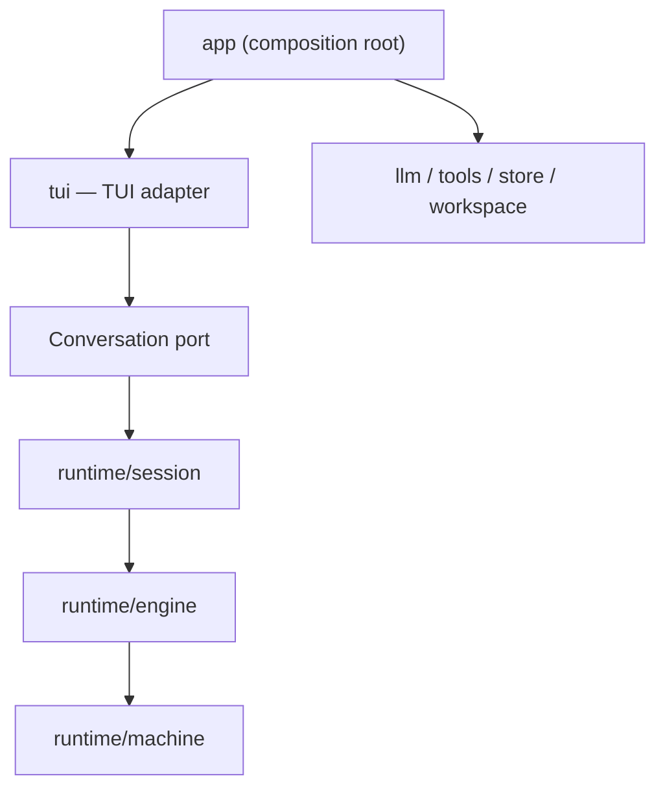
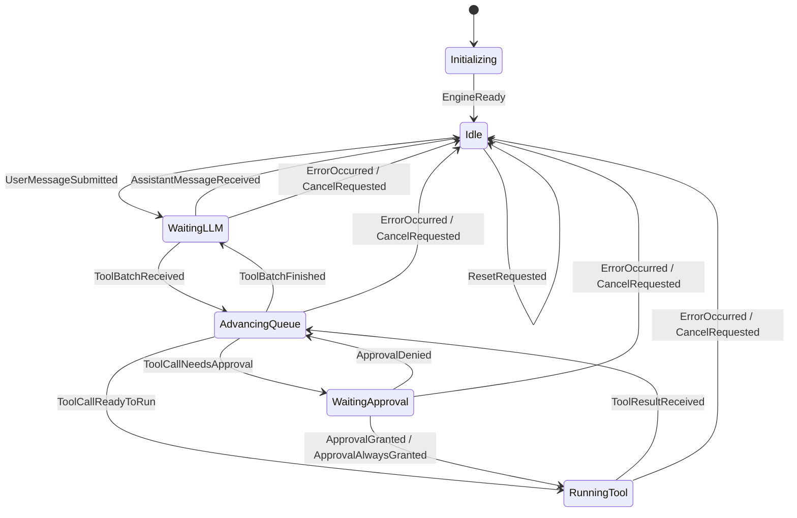

# Architecture

Super Agent follows a hexagonal architecture with a state-machine domain core.



## Dependency Rule

- `runtime/machine` is the domain core. It owns states, events, runtime-data changes, action plans, scheduled actions, and transitions.
- `runtime/protocol` owns model and tool adapter contracts without state-machine policy.
- `runtime/permission` owns permission request and command classification value types.
- `runtime/engine` drives the machine. It owns the single agent loop, synchronization, scheduled-action draining, and run identity.
- `runtime/execution` implements outbound model, tool, and permission ports.
- `runtime/session` exposes application use cases. It must not contain terminal behavior.
- `tui` is an inbound adapter. It depends only on its `Conversation` port and display DTOs.
- `app` is the composition root. It creates dependencies and converts runtime values to TUI values.
- Runtime states become presentation-only `tui.AgentStatus` values at the app boundary; TUI owns no runtime state enum.
- `llm`, `tools`, `store`, and `workspace` are top-level outbound adapters.

Session persistence crosses two outbound ports:

- `session.Repository`: transcript, metadata, approval, and checkpoint lookup operations.
- `session.Workspace`: file capture for checkpoints and restoration for undo.

Their implementations live in top-level `store` and `workspace`; the runtime facade exposes only ports.

Session use cases are separated by intent:

- `session.go`: construction, configuration, reset, and snapshots.
- `turn.go`: one conversational turn and approval flow.
- `history.go`: saved sessions, compaction, and undo.
- `persistence.go`: best-effort persistence notifications.

The TUI follows the same separation:

- `app.go`: Bubble Tea model construction and conversation rendering.
- `update.go`: Bubble Tea message routing and state updates.
- `commands.go`: slash commands and turn submission.
- `actions.go`: cancel and clipboard actions.
- `view.go`: top-level layout and informational views.
- `styles.go`: visual theme.

Dependencies point inward. In particular, `tui` must never import `runtime`, and the runtime must never import `tui`.

The root `runtime` package is a compatibility facade organized by `api_model.go`, `api_machine.go`, `api_execution.go`, `api_engine.go`, and `api_session.go`. Internal packages must depend on the narrow package that owns a type, not on this facade.

The TUI is the only interaction surface. Headless CLI, HTTP server, WebSocket, and alternate UI adapters are out of scope.

## Runtime Rule

```mermaid
flowchart LR
    Event --> Snapshot[Validated MachineSnapshot] --> Transition --> "RuntimeDataChange + ActionPlan" --> RuntimeDataChangeApplier[Transactional RuntimeDataChangeApplier] --> Commit[Atomic Engine Commit] --> ScheduledActionRunner --> ActionResultResolver --> Event
```

The state machine this rule produces:



`ErrorOccurred`, `CancelRequested`, and `ResetRequested` return to `Idle` from any state; `ResetConversation` preserves `system` messages.

The engine drops stale `RunID` results before event resolution. `Engine.RunTurn` starts a run with `UserMessageSubmitted`; other external machine events enter through `Engine.DispatchEvent`. The transition's action plan determines whether the loop has work. `AwaitApproval` uses a Session-provided approval port, so human input follows the same scheduled-action/result/event path as model and tool work without moving scheduling into Session. `State` names the current execution state; `RuntimeData` contains the complete mutable machine data. `SnapshotFrom` validates runtime data and exposes only transition guards. `Transition` owns state/event compatibility plus call and queue guards. The `RuntimeDataChangeApplier` clones runtime data, applies runtime-data changes, and validates the result. The engine then commits runtime data and the `ActionPlan` under one lock. Scheduled actions run only after that commit.

Errors distinguish incompatible events (`UnexpectedEventError`), current-run protocol mismatches (`ProtocolViolationError`), and impossible machine state (`InvariantViolationError`).

## Refactoring Rules

- Prefer concrete domain names over generic plumbing names.
- Keep interfaces at adapter boundaries, not between every internal function.
- Keep files focused on one responsibility.
- Convert transport and display DTOs only at the composition boundary.
- Preserve behavior with transition and application-use-case tests.

Engine files follow these responsibilities:

- `engine.go`: dependencies and construction.
- `query.go`: immutable snapshots and state queries.
- `commands.go`: public runtime commands and approval handling.
- `action_loop.go`: transition dispatch and scheduled-action draining.

Permission decisions live in `execution/policy.go`; shell inspection lives in `execution/command_analyzer.go`.
