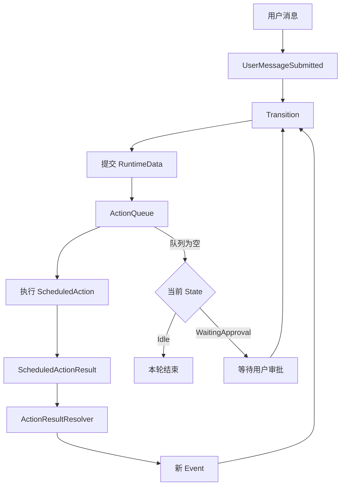

# 本项目的 Agent Loop

## Agent Loop 在哪里

本项目没有名为 `AgentLoop` 的单一函数。完整循环由两层组成：

| 层级 | 函数 | 职责 |
|---|---|---|
| Engine 动作循环 | `runtime/engine/action_loop.go` 的 `runScheduledActions` | 执行动作、把结果转成事件、继续状态转移 |
| Session 交互循环 | `runtime/session/turn.go` 的 `runTurnLoop` | 启动一轮任务，并在需要审批时等待用户 |

其中，`runScheduledActions` 是核心 Agent Loop。

## 循环的起点

从用户操作开始，调用链是：

```text
用户按 Enter
  -> tui.App.submit
  -> tui.App.submitPrompt
  -> TUIConversation.RunTurn
  -> session.Session.RunTurn
  -> session.runTurnLoop
  -> engine.DispatchEventThenRunActions(UserMessageSubmitted)
  -> Transition
  -> ActionQueue 加入 CallModel
  -> engine.runScheduledActions
```

因此可以分别确定三个入口：

- 交互入口：`tui/commands.go` 的 `submitPrompt`。
- 一轮对话入口：`runtime/session/turn.go` 的 `RunTurn`。
- 自动循环入口：`runtime/engine/action_loop.go` 的 `runScheduledActions`。

真正启动第一轮循环的是这一行：

```go
return e.runScheduledActions(runCtx, chunks)
```

在调用它之前，`DispatchEventThenRunActions` 已经派发 `UserMessageSubmitted`，状态转移已经把第一个 `CallModel` 放入 `ActionQueue`。所以循环第一次 `Pop` 得到的通常是 `CallModel`。

## 完整闭环



核心关系是：

```text
Event
  -> Transition
  -> RuntimeDataChange + ScheduledAction
  -> 执行 ScheduledAction
  -> ScheduledActionResult
  -> 新 Event
  -> Transition
```

## Engine 动作循环

`runScheduledActions` 不断从 `ActionQueue` 取出动作：

```go
func (e *Engine) runScheduledActions(
	ctx context.Context,
	chunks func(protocol.StreamChunk),
) error {
	for {
		action, ok := e.actionQueue.Pop()
		if !ok {
			return nil
		}
		if err := e.executeScheduledAction(ctx, action, chunks); err != nil {
			return err
		}
	}
}
```

真实代码还负责加锁、取消、错误转移、`RunID` 检查和状态通知。

`executeScheduledAction` 完成三个步骤：

1. 使用 `ScheduledActionRunner` 执行动作。
2. 使用 `ActionResultResolver` 把结果转换成新事件。
3. 派发新事件；新的 `TransitionResult` 可能继续向队列加入动作。

因此，循环不是直接调用自己，而是通过队列形成：

```text
取动作 -> 执行动作 -> 产生事件 -> 状态转移 -> 加入新动作 -> 再次取动作
```

## 一次普通回答

用户提交消息后：

```text
Idle + UserMessageSubmitted
  -> WaitingLLM
  -> CallModel
  -> ModelReplied
  -> AssistantMessageReceived
  -> Idle
```

`AssistantMessageReceived` 不再产生新动作，队列为空且状态为 `Idle`，本轮结束。

## 一次工具调用

模型返回工具调用时，循环会继续：

```text
CallModel
  -> ToolBatchReceived
  -> CheckToolQueue
  -> ToolCallReadyToRun
  -> RunTool
  -> ToolResultReceived
  -> CheckToolQueue
```

工具批次处理完后：

```text
ToolBatchFinished
  -> CallModel
```

工具结果会作为消息再次发送给模型。模型可以继续调用工具，也可以返回最终回答。

## 审批为什么需要 Session 循环

如果工具需要用户审批，状态机会进入 `WaitingApproval`，但不会产生 `ScheduledAction`：

```text
CheckToolQueue
  -> ToolCallNeedsApproval
  -> WaitingApproval
  -> 动作队列为空
```

此时 Engine 动作循环返回，`Session.runTurnLoop` 检查到 `WaitingApproval`，等待用户输入：

```go
for {
	switch s.engine.State() {
	case StateWaitingApproval:
		decision, err := waitApproval(ctx, approvals)
		// 根据决定调用 Approve、ApproveAlways 或 Deny
	case StateIdle:
		return nil
	}
}
```

审批完成后，Engine 产生 `RunTool` 或 `CheckToolQueue`，再调用 `runScheduledActions` 恢复自动循环。

## 循环何时结束

Agent Loop 会在以下位置停下：

- `Idle` 且动作队列为空：正常完成。
- `WaitingApproval` 且动作队列为空：暂停并等待用户。
- 收到取消：清空动作队列并回到 `Idle`。
- 执行动作失败：转成 `ErrorOccurred`，清理队列并回到 `Idle`。
- `RunID` 已过期：丢弃迟到结果，防止污染新任务。

## 代码阅读顺序

```text
runtime/session/turn.go
  -> runtime/engine/action_loop.go
  -> runtime/execution/scheduled_action_runner.go
  -> runtime/execution/scheduled_action_executor.go
  -> runtime/execution/action_result_resolver.go
  -> runtime/machine/transition.go
```

一句话总结：`Transition` 决定下一步，`ActionQueue` 驱动自动循环，`Session` 负责需要人工输入的暂停与恢复。
