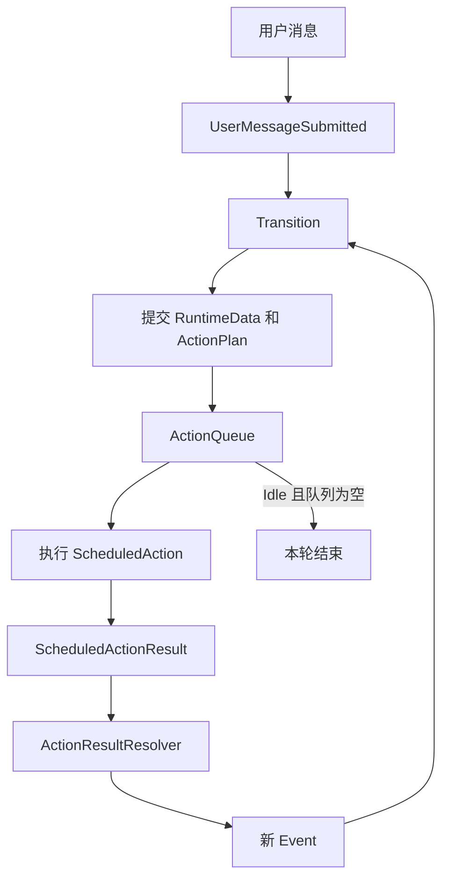

# 本项目的 Agent Loop

## 唯一循环在哪里

核心 Agent Loop 是 `runtime/engine/action_loop.go` 的 `runScheduledActions`。Engine 独占动作调度、RunID、错误恢复和运行结束判断；Session 只提供审批输入、流式输出、通知和持久化端口。

```text
Session.RunTurn
  -> Engine.RunTurn(UserMessageSubmitted, ApprovalWaiter)
  -> Engine.dispatchEvent
  -> Transition
  -> ActionQueue
  -> Engine.runScheduledActions
```

Session 没有第二个 turn 循环，也不读取状态来决定是否执行下一个 action。

## 完整闭环



核心关系：

```text
Event
  -> Transition
  -> RuntimeDataChange + ActionPlan
  -> ScheduledAction
  -> ScheduledActionResult
  -> Event
```

## Engine 动作循环

`runScheduledActions` 不断从 `ActionQueue` 取出动作：

```go
func (e *Engine) runScheduledActions(
	ctx context.Context,
	onStreamChunk func(protocol.StreamChunk),
	approvalWaiter execution.ApprovalWaiter,
) error {
	for {
		action, ok := e.actionQueue.Pop()
		if !ok {
			if e.runtimeData.State == machine.StateIdle {
				return nil
			}
			return machine.InvariantViolationError{}
		}
		if err := e.executeScheduledAction(ctx, action, onStreamChunk, approvalWaiter); err != nil {
			return err
		}
	}
}
```

真实代码还负责加锁、完成 Run、取消、错误转移、`RunID` 过滤和状态通知。

`executeScheduledAction` 执行以下闭环：

1. `ScheduledActionRunner` 执行动作。
2. `ActionResultResolver` 把结果转换成事件。
3. `Transition` 计算下一状态与 `ActionPlan`。
4. Engine 原子提交结果，新动作进入队列。

## ScheduledAction 类型

- `CallModel`：调用模型。
- `RunTool`：执行一个工具调用。
- `CheckToolQueue`：检查工具批次中的下一项。
- `AwaitApproval`：通过注入的 `ApprovalWaiter` 等待用户决定。

模型、工具和用户审批都使用同一个 action-result-event 流程。

## 普通回答

```text
UserMessageSubmitted
  -> CallModel
  -> ModelReplied
  -> AssistantMessageReceived
  -> Idle
  -> 队列为空，FinishRun
```

## 工具调用

```text
CallModel
  -> ToolBatchReceived
  -> CheckToolQueue
  -> ToolCallReadyToRun
  -> RunTool
  -> ToolResultReceived
  -> CheckToolQueue
```

工具批次处理完后：

```text
ToolBatchFinished
  -> CallModel
```

## 审批属于同一个循环

需要审批时，状态机进入 `WaitingApproval` 并调度 `AwaitApproval`：

```text
CheckToolQueue
  -> ToolCallNeedsApproval
  -> WaitingApproval
  -> AwaitApproval
```

`AwaitApproval` 通过 Session 注入的端口读取审批 channel，但动作仍由 Engine 循环执行：

```text
AwaitApproval
  -> ApprovalReceived
  -> ApprovalGranted / ApprovalAlwaysGranted / ApprovalDenied
  -> RunTool / CheckToolQueue
```

审批等待期间 Run context 保持有效；取消 context 会终止等待并触发 `CancelRequested`。

## Session 的职责

`runtime/session/turn.go` 不调度 action，只为 Engine 提供：

- `ApprovalWaiter`：读取审批、持久化决定。
- `onStreamChunk`：发送流式通知。
- state observer：把 Engine 快照转换成 `SessionNotification`。

这种结构保持依赖方向：Session 启动用例，Engine 拥有 Agent Loop，Execution 执行动作，Machine 决定转移。

## 循环何时结束

- `Idle` 且动作队列为空：正常完成并结束 Run。
- action 返回错误：提交 `ErrorOccurred` 后返回错误。
- context 取消或审批输入中断：提交 `CancelRequested` 后返回。
- `RunID` 过期：丢弃迟到结果；循环随后根据当前队列和状态结束。
- 非 `Idle` 状态下队列为空：返回 `InvariantViolationError`，因为活动状态必须有待执行或正在执行的 action。

## 代码阅读顺序

```text
runtime/session/turn.go
  -> runtime/engine/action_loop.go
  -> runtime/execution/scheduled_action_runner.go
  -> runtime/execution/scheduled_action_executor.go
  -> runtime/execution/action_result_resolver.go
  -> runtime/machine/transition.go
```

一句话总结：`Transition` 决定下一步，Engine 的唯一动作循环持续推进，Session 只连接用户输入与通知。
